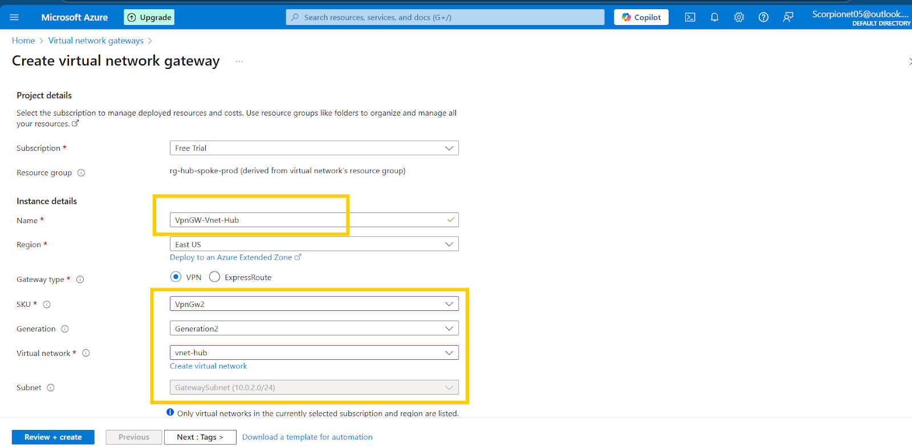

# Vnet & Peering Setup

1. Select resource group\> create: **rg-hub-spoke-prod**\> select region: **EastUS**\> Next\> Review+Create.  
   
   
   

**Hub Network Setup**

1. Virtual network\> create\> Vnet Name: **vnet-hub**\> Region**: EastUS**\> Next  
     
     
     
     
     
     
2. IP Address\> Give Address space: **10.0.0.0/16** \> Select default\> select purpose: Virtual Network Gateway\> Name: Gateway subnet: **10.0.2.0/24** \> Save.  
      
     
   Go to AzureFirewallSubnet\>edit\> Start address: **10.0.0.0/26** \> Save.  
      
     
   Go to AzureBastianSubnet\>edit\>Start address: **10.0.1.0/26** \> Save.  
     
     
   Click Next\> Review+ Create.  
     
     
     
     
   

**Spoke Network Setup**

1. Virtual network\> create\> Vnet Name: **vnet-spoke1**\> Region**: EastUS**\> Next  
    

2. IP Address\> Give Address space: **10.1.0.0/16** \> Select default\> select purpose: Default\> Name: Subnet1: **10.1.0.0/24** \> Save \> Review+Create.  
     
     
      
     
    

3. Again repeat the same steps to create Vnet-Spoke2.  
     
     
     
     
     
     
   

**Virtual Network Gateway Setup:**

1. Virtual NW gateway \> Create\> Name: **VpnGW-Vnet-Hub** \> Select gateway type: **VPN** \>SKU: **VpnGw2** \> Virtual Networks: Select **Vnet-hub** (gateway subnet will be autodetected) \> Select create Public IP\> Name : **Pip-VpnGW-Vnet-Hub** (azure will assign a public IP)\> Disable active-active mode & BGP \> Review+create.  
      
     
    
     
      
     
     
      
     
     
     
   

# VNet Peering

**Hub-to-Spoke Peering (Repeat for both spokes):**

1. Go to Vnet-hub \>Settings\> Peerings\>Add\> Name: **spoke1-to-hub** \> Select virtual network: **Vnet-Spoke1** \> Allow (Vnet access, Forward Traffic & Gateway Transit) \> at Local virtual network \> Name: **hub-to-spoke1** \> Allow (Vnet access & Remote Gateway) \>Add \>   
      
     
     
    
      
      
2. Similarly, follow the same for Vnet-Spoke2.  
   Go to Vnet-hub \>Settings\> Peerings\>Add\> Name: **spoke2-to-hub** \> Select virtual network: **Vnet-Spoke2** \> Allow (Vnet access, Forward Traffic & Gateway Transit) \> at Local virtual network \> Name: **hub-to-spoke2** \> Allow (Vnet access & Remote Gateway) \>Add   
     
     
      
      
     

