# Deploy Azure Bastion

1. Go to Bastions\> Create\> select resource group\>Name bastion service: **Bastion-Hub-spoke** \>Tier: **Standard**\> Virtual Network: **Vnet-Hub** \> Bastion subnet will automatically selected \>Create Public IP\> Name: **PIP-Bastion** \>Next  
     
   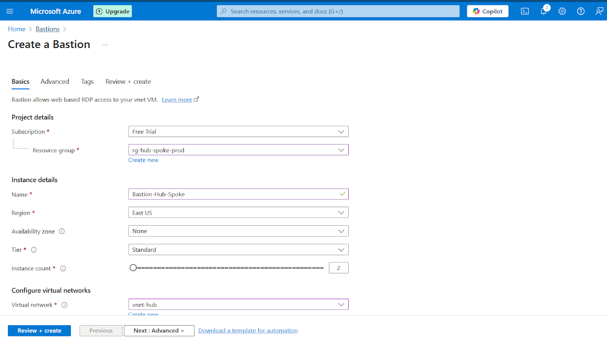   
     
   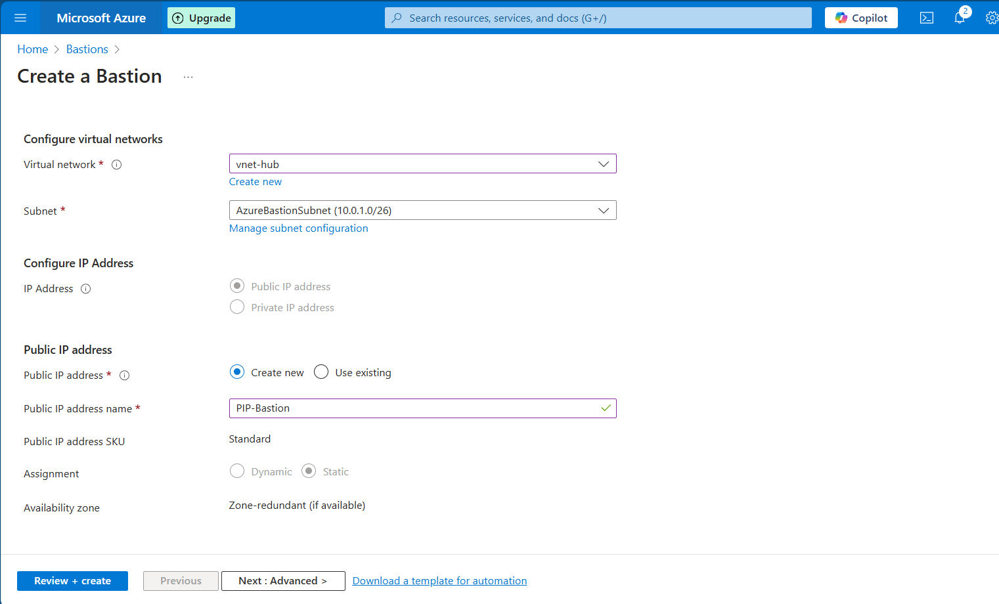  
2. Select copy paste option\> Next\> Review+Create.  
     
   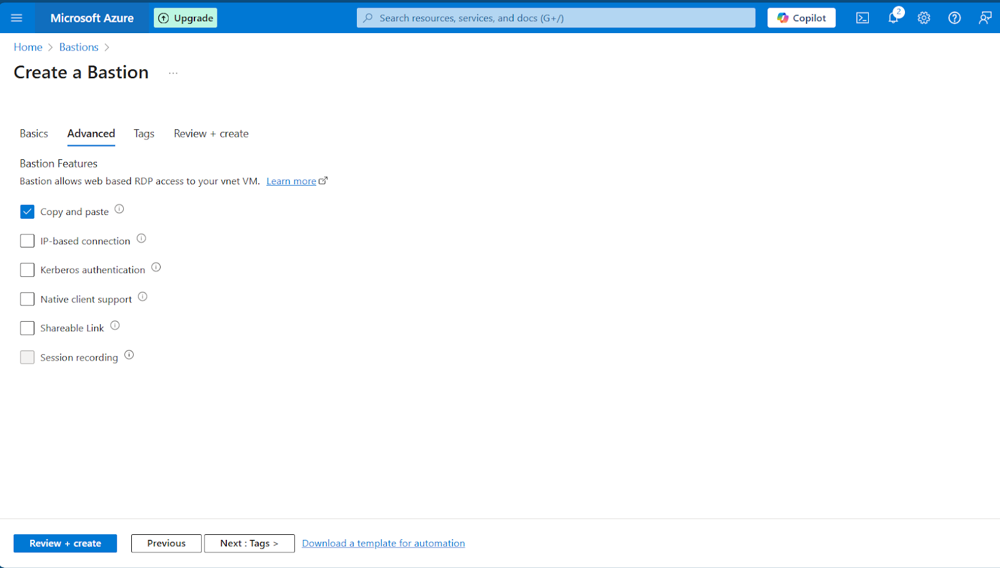   
     
   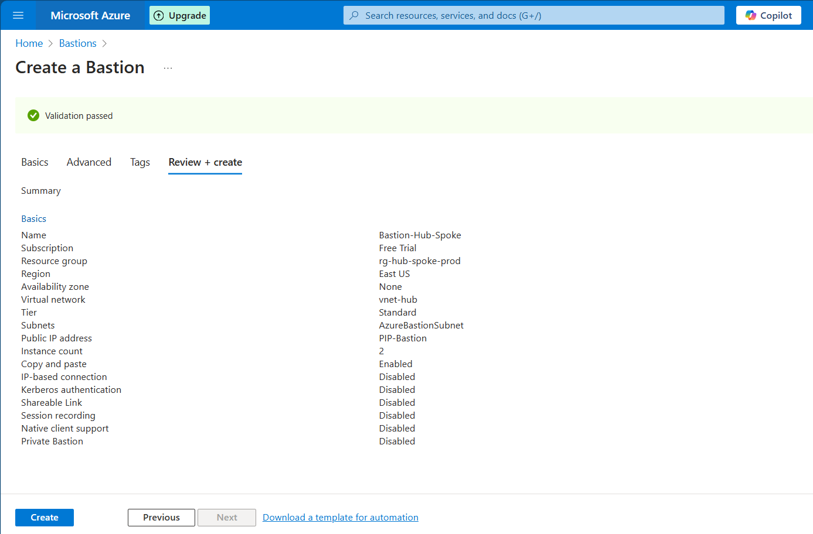   
     
     
     
   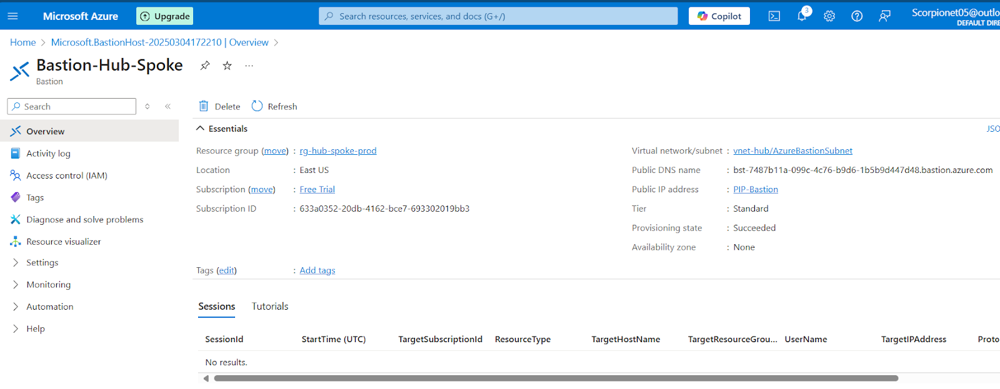  
   

# Test Connection:

1. Connect to the virtual machines in the spoke Vnets or Hub Vnet.  
     
   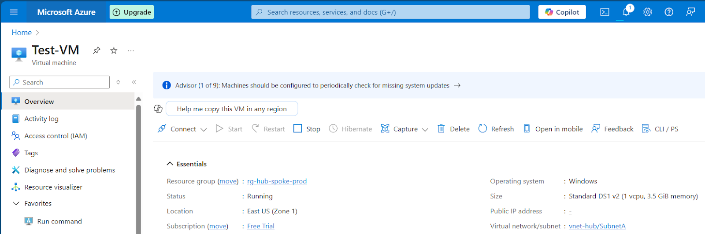   
     
   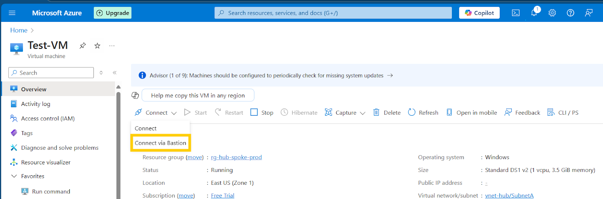  
     
   Set the password and username for the virtual machine and connect. Unblock the pop-up in the address bar when prompted.  
     
   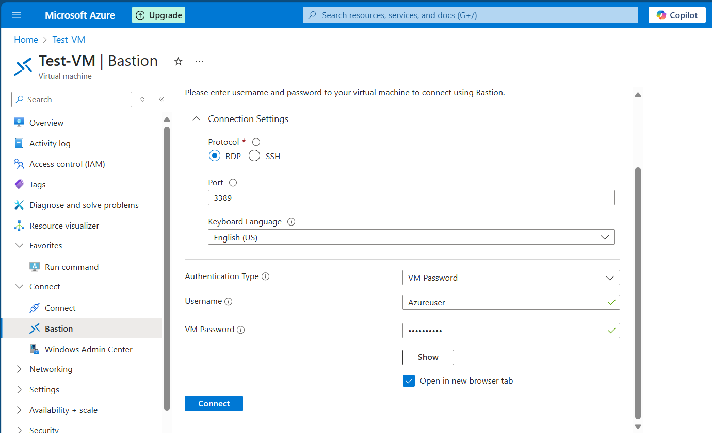  
     
   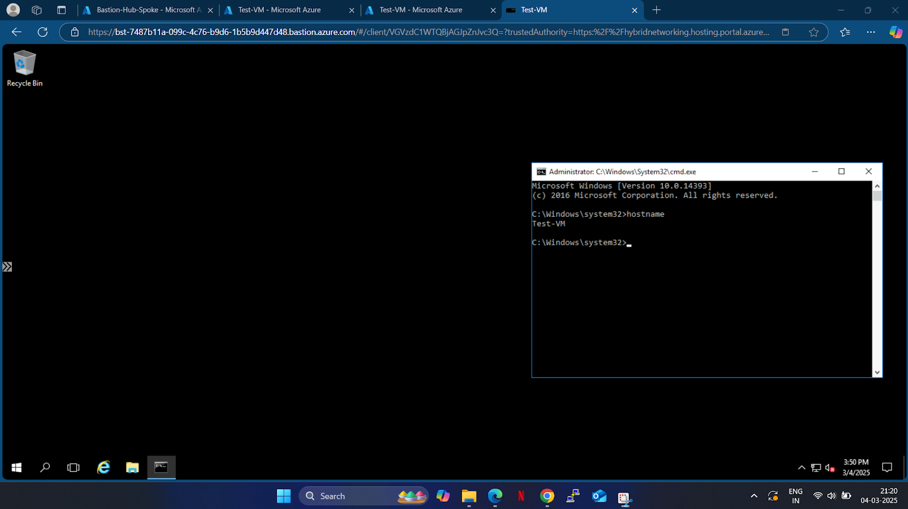   
     
   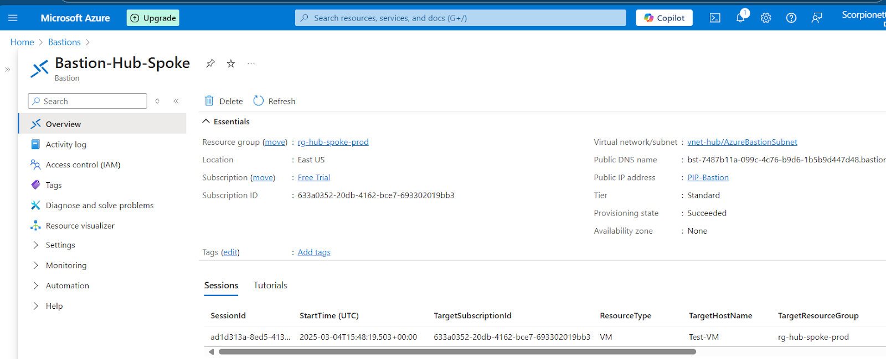  
     
     
   Connecting to VM in Spoke1 Vnet.
   
   

     
   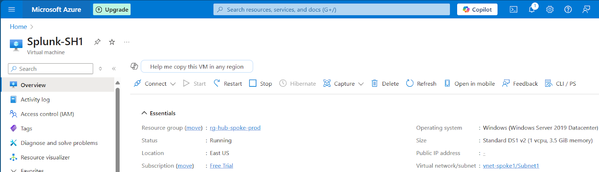
     
   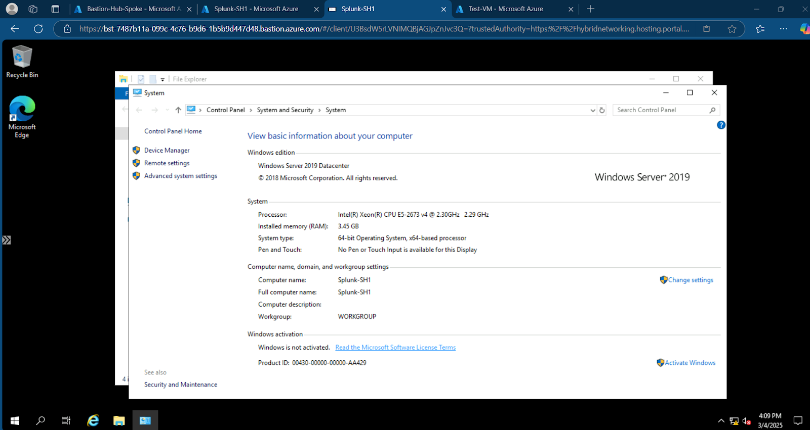 
     
     

