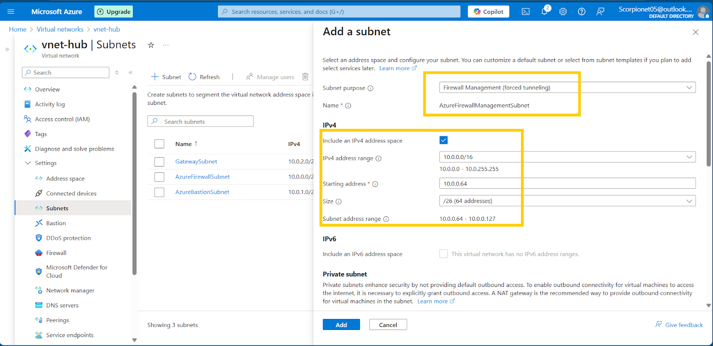
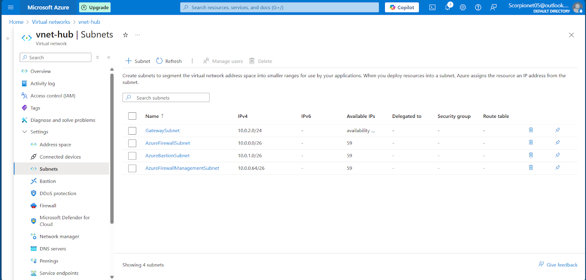
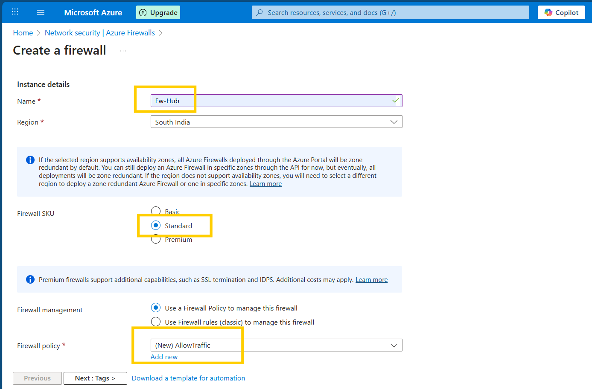
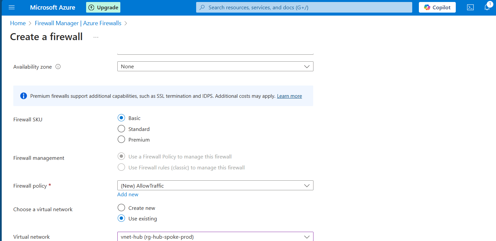
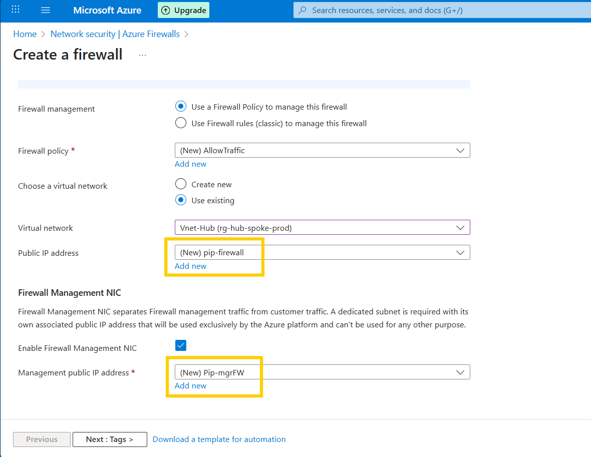
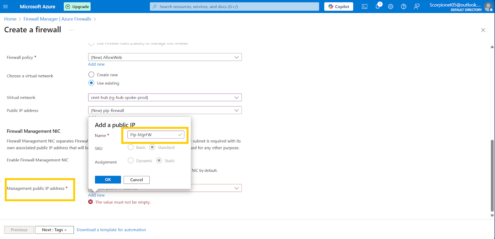
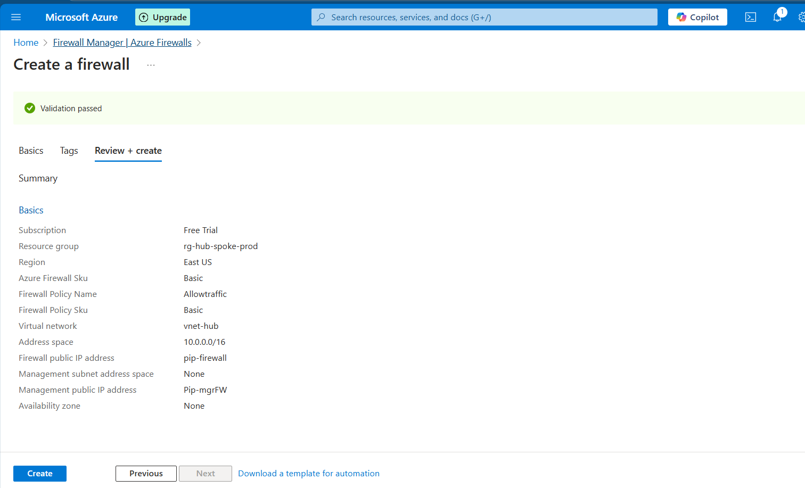
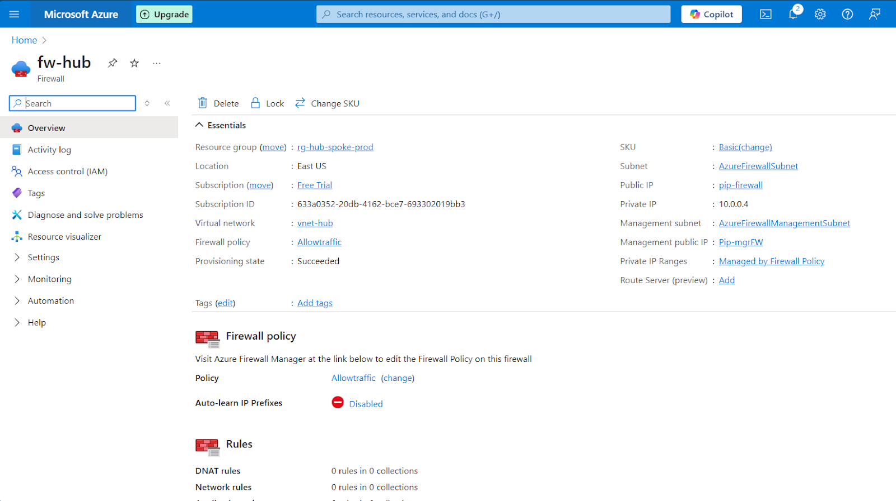
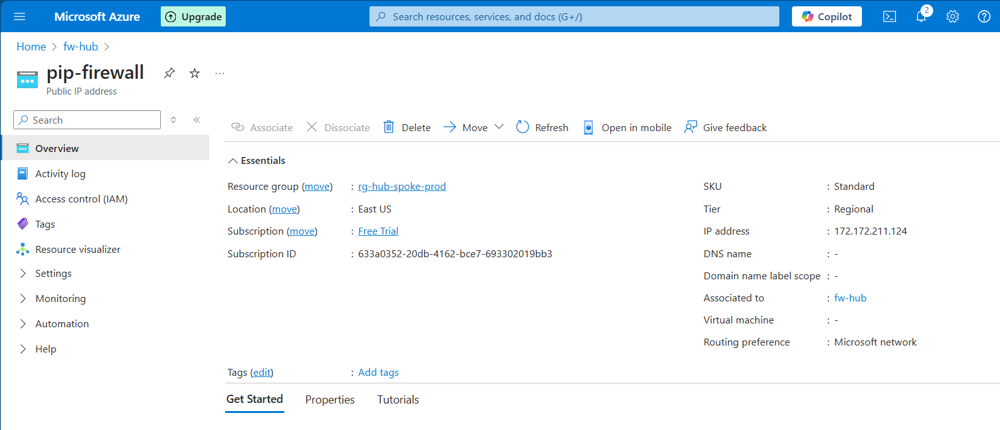

# Deploy Azure Firewall & Policies

1. Got to Vnet-hub\>settings\>Subnets\>Add\>Purpose: Firewall Management\>starting IP: 10.0.0.64\>save.  
      
      
     
2. Navigate to Firewall Manager\>create\>select resource group\>SKU: **Basic** \> Firewall policy(new)\>Policy Name: **AllowTraffic**\>ok\> Choose Virtual Network: **Vnet-hub**  
      
     
     
     
   Next on Public IP(new)\> Name: **pip-firewall**\>Ok \> Management public IP address(new)\> Name: **Pip-mgrFW**\> Ok \> Review+Create.  
     
     
     
     
      
     
     

