# Create User-Defined Routes (UDRs) for traffic steering

**Create a Route table to route all the traffic for virtual networks through the azure firewall.**

1. Go to Route Tables \>Create\> Select Resource Group\>Name:**Route-FW** \>Propagate gateway routes: **Yes** \> Next \> Review+Create.  
   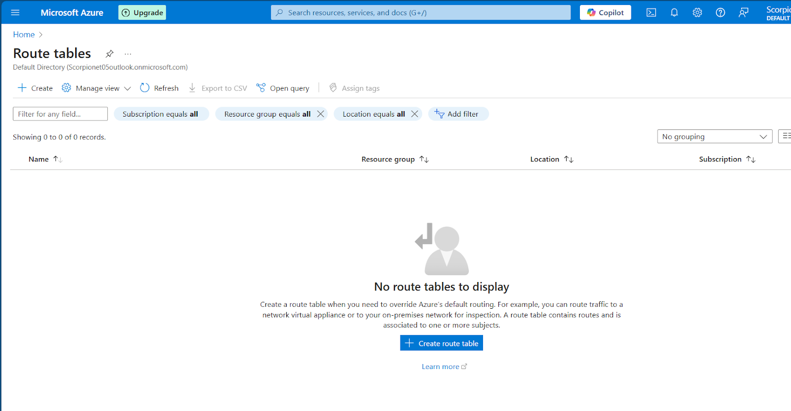   
   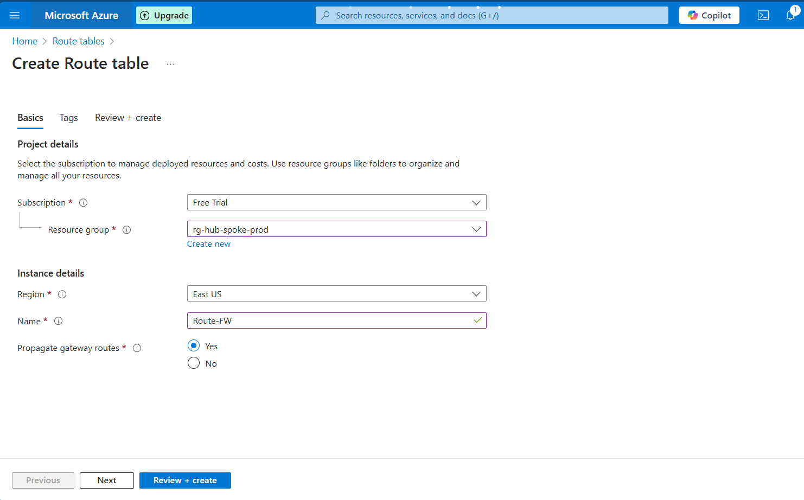  
     
   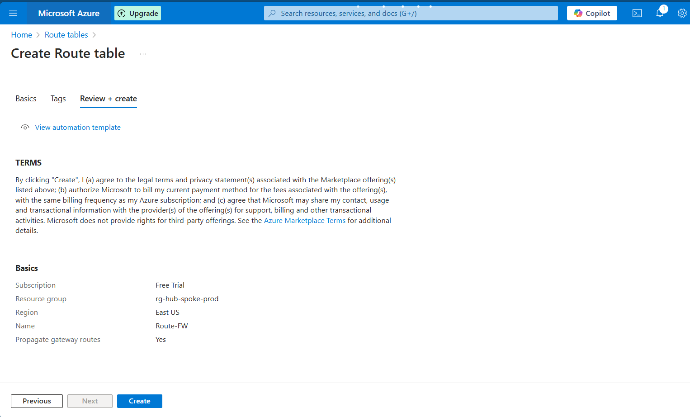 
     
 

2. Go to the route table created\> Routes\>Add\> Name:**Allow-traffic-only-firewall** \> Destination type:IP Address**(0.0.0.0/0) Any address** \> Next Hop type: **Network Virtual Appliance** \> Next Hop Address: **Private IP of Firewall(10.0.0.4)** \> Add  
   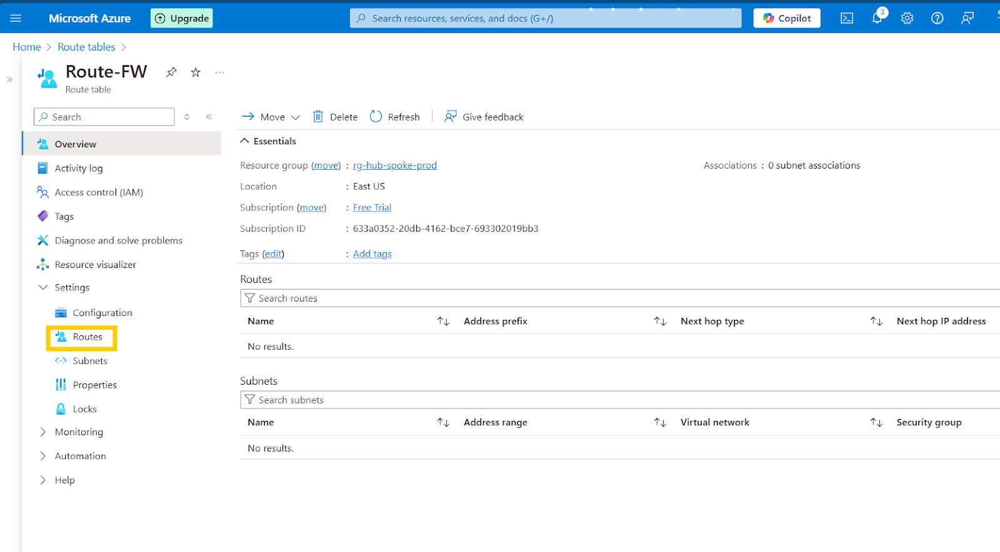  
     
   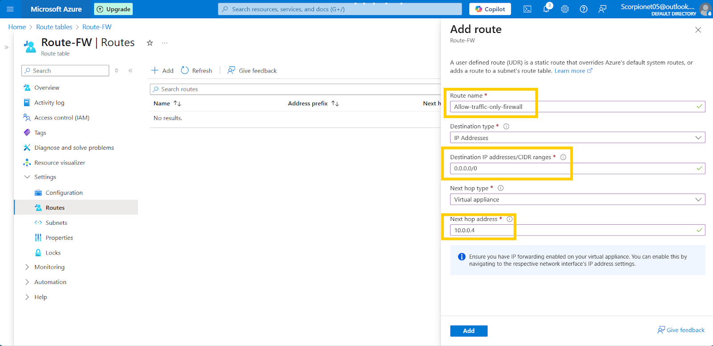  
     
     
     
     
3. Go to Subnet\>associate\>Vnet-spoke-1 and Subnet1\>Ok  
     
   Similarly, follow for other virtual networks.  
     
   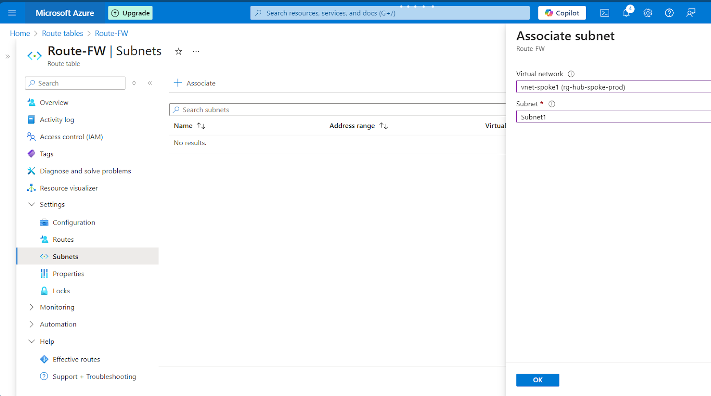 
     
 

   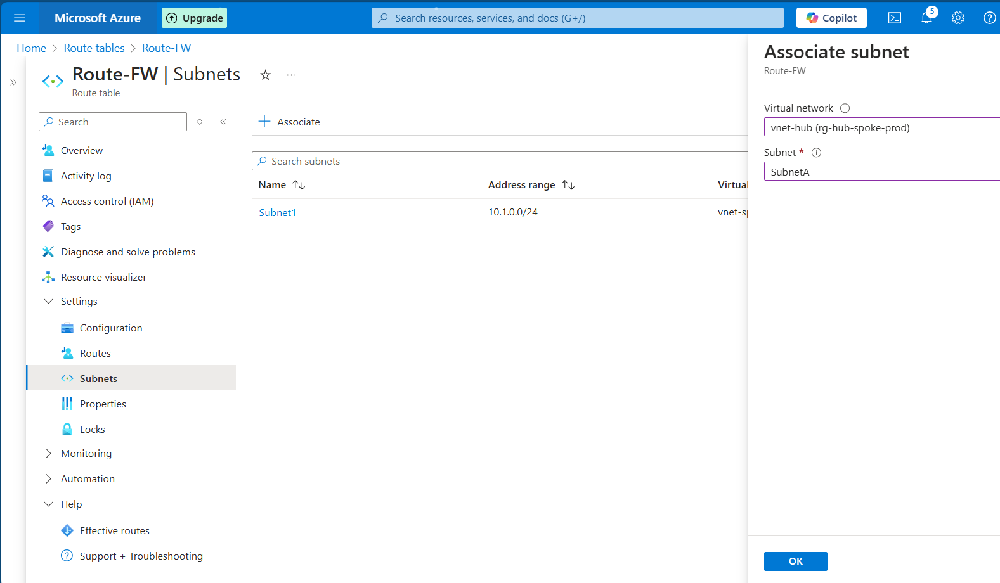

   

   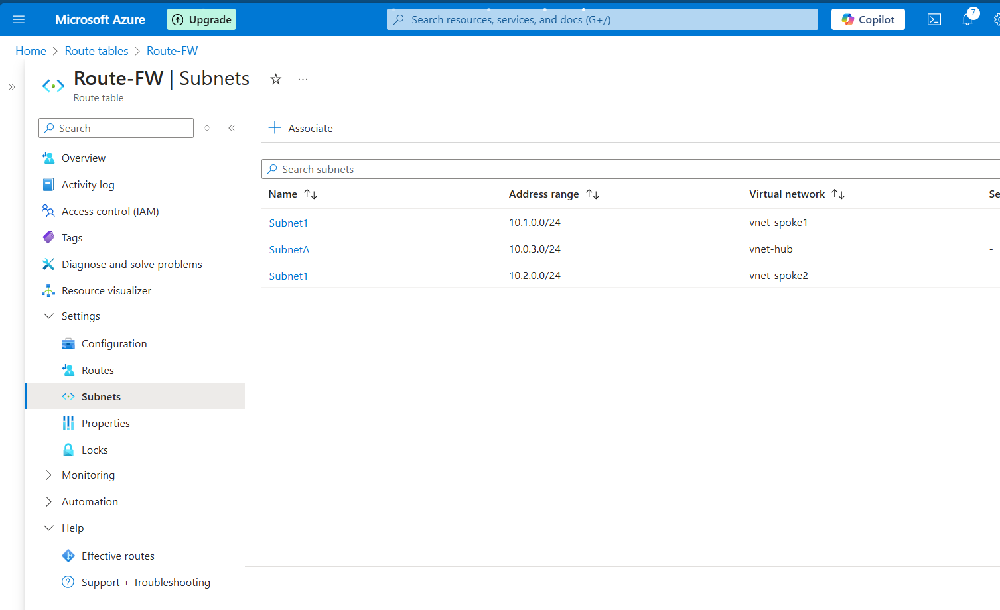

   

   

   

**Create Firewall DNAT rule to allow rdp connections to Virtual machines.**
----------------------------------------------------------------------------

   

1. Go to fw-hub\> **Allowtraffic** policy\> DNAT rules\> Add Rule collection\> Name: **Allow-RDP**\> Rule collection type: DNAT\> Priority: **100\.**  
2. In the Rules- 

   Name: Allow-rdp-SpokeVM

   Source Type: Ip Address

   Source: \* (any)

   Destination Ports: 3389

   Destination: firewall Public IP

   Translated type: IP Address

   Translated address: Private IP of VM

   Translated Port: 3389 

   

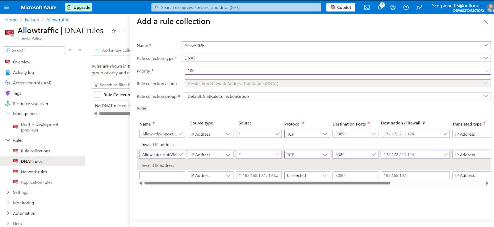

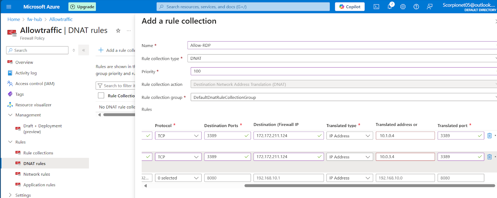  
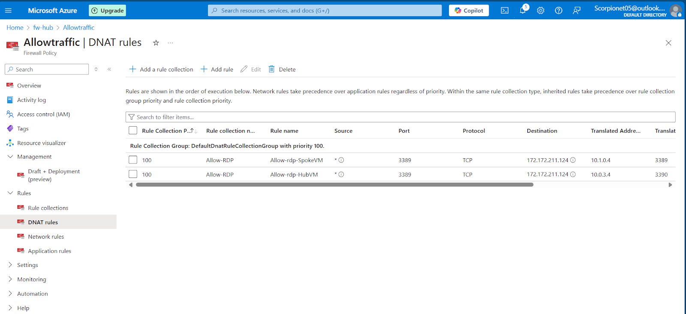

**Testing:** 

1. Connect to the Virtual machine from the firewall public IP.  
2. Check internet connectivity from VM is disabled. (because by default firewall denies any traffic)

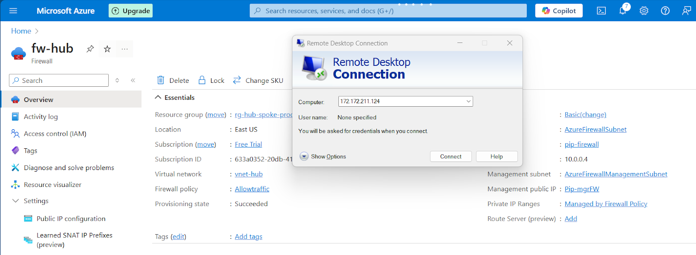

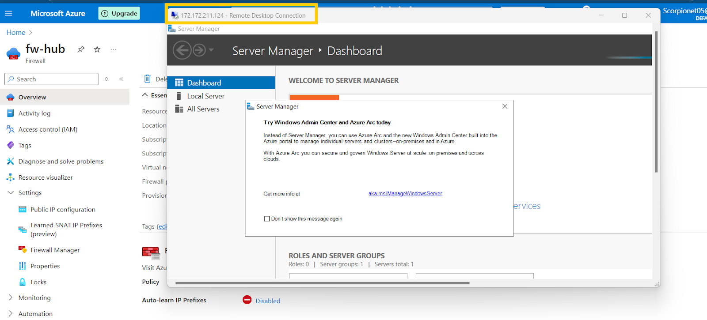

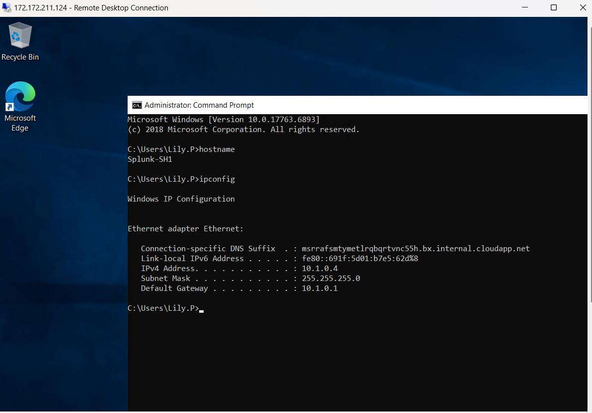

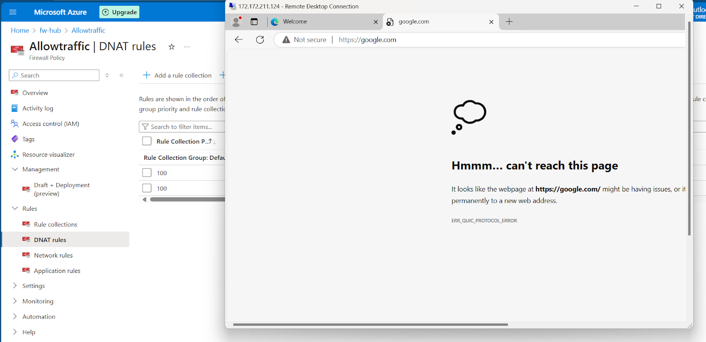

**Create Firewall Network rule to allow internet connections from Virtual machines.**
--------------------------------------------------------------------------------------

1. Go to fw-hub\> **Allowtraffic** policy\> Network rules\> Add Rule collection\> Name: **Allow-Internet-access**\> Rule collection type: Network\> Priority: **200**.  
2. In the Rules- 

   Name: Allow-Internet-access

   Source Type: Ip Address

   Source: Private IP of VM

   Destination Ports: 80,443

   Destination: \* (any)

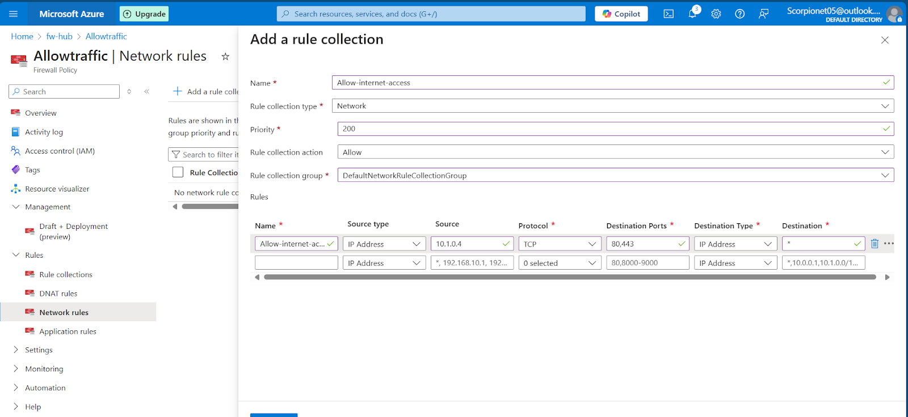 
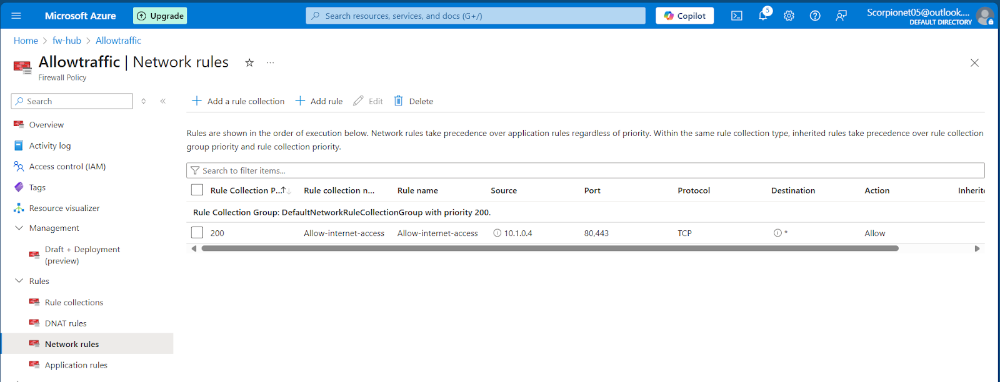

**Testing**: Check the internet connectivity from the VM should be enabled.

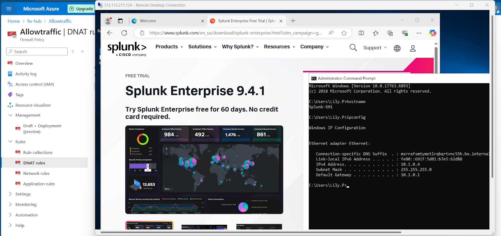

