# Azure Private DNS Zone Setup

## 1. Create the Private DNS Zone

- Search for Private DNS Zones and click + Create.

- Choose your subscription and resource group. Region should be the same as that of  Vnet region that needs to be attached with the zone.

- Enter a DNS zone name (e.g., internal.Quantumspace.com)

- Click Review + Create, then Create.

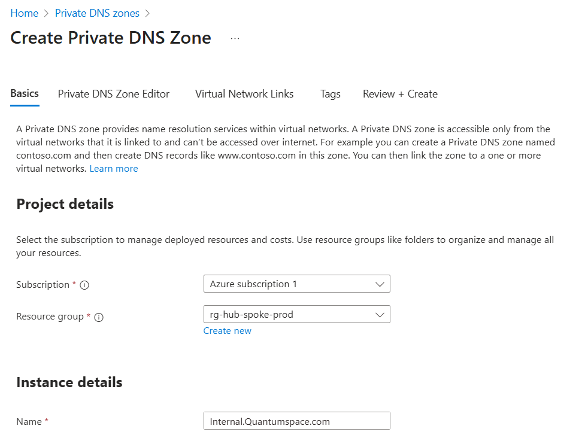

## 2. Link Azure VNets to the DNS Zone

- Once the zone is created, open it.

- Go to Virtual Network Links > + Add.

- Give the name of the Link: Zone-Link-Hub

- Select your hub VNet (and optionally spoke VNets).

- Enable Auto-registration if you want Azure VMs to register automatically.

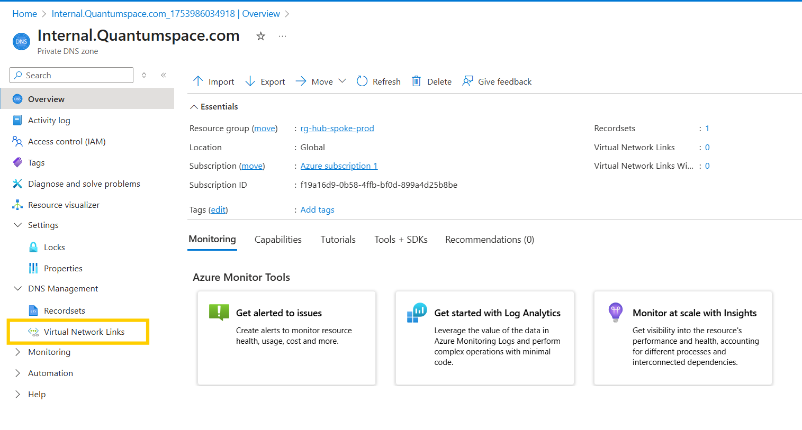

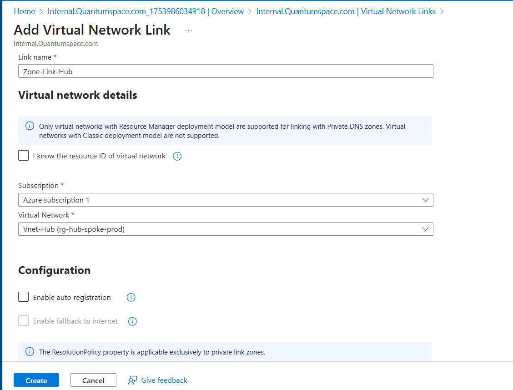

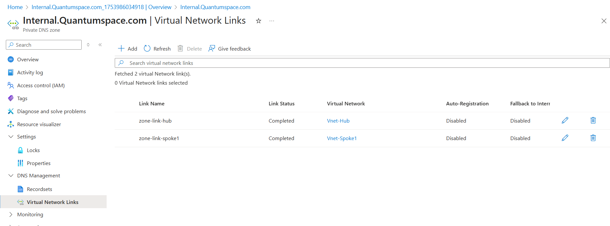

## 3. Deploy Azure DNS Private Resolver

This allows DNS queries from on-prem to resolve Azure private DNS names.

- Create a DNS Private Resolver in the hub VNet. Give name and select vnet-hub and go next.

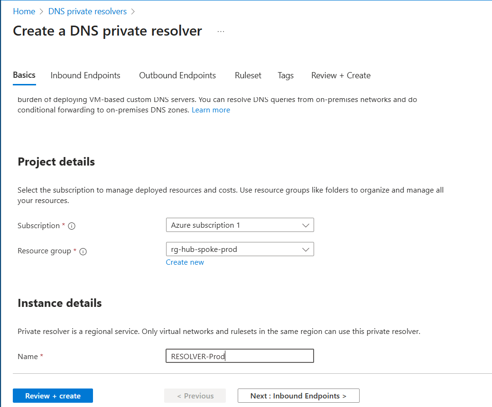

- Add: Inbound endpoint: For on-prem DNS servers to forward queries.

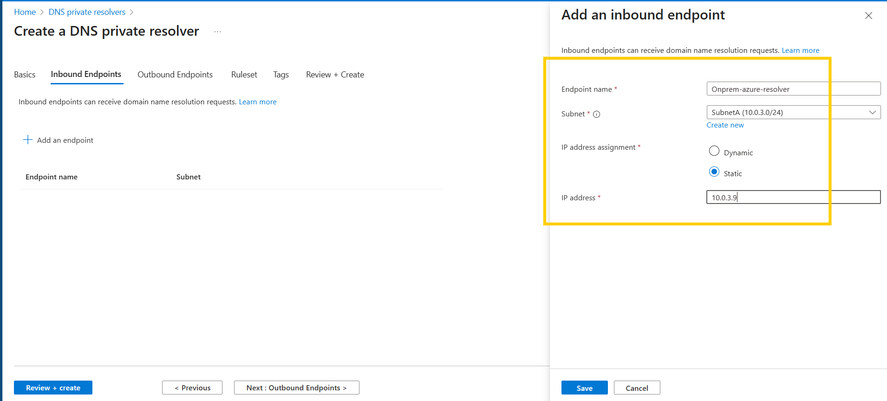

- Outbound endpoint: For forwarding queries to Azure DNS (if needed).

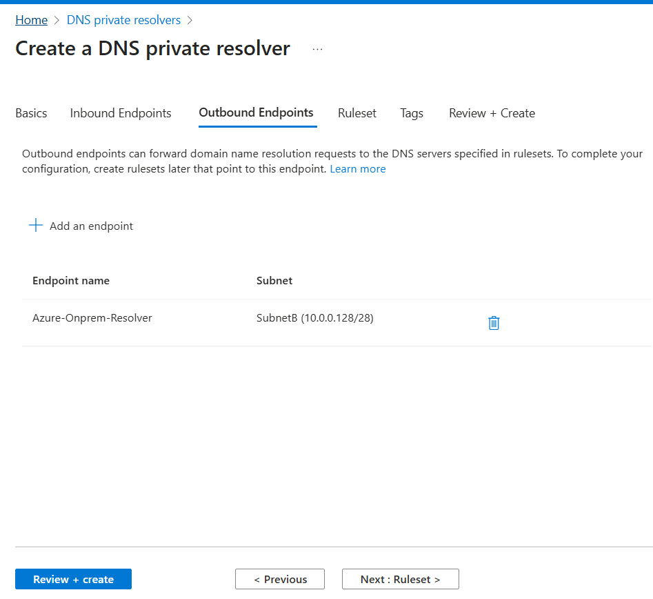

## Configure DNS forwarding ruleset to forward queries for internal.contoso.com to Azure DNS.

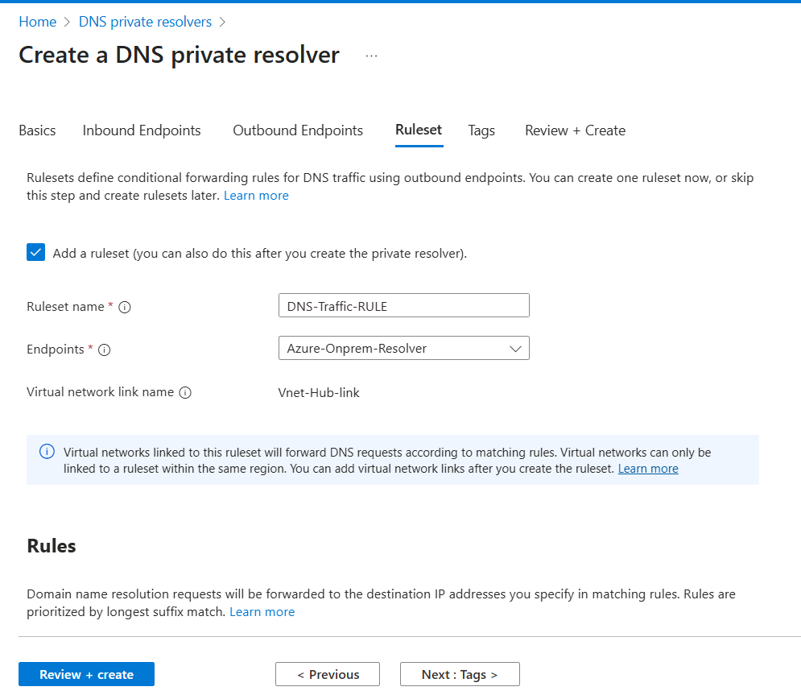

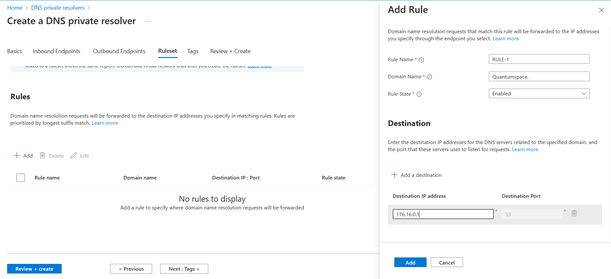

## 4. Configure On-Prem DNS Forwarding

- On your on-prem DNS server (e.g., Windows Server DNS): Add a conditional forwarder for internal.Quantumspace.com.

- Point it to the inbound endpoint IP of the Azure DNS Private Resolver.

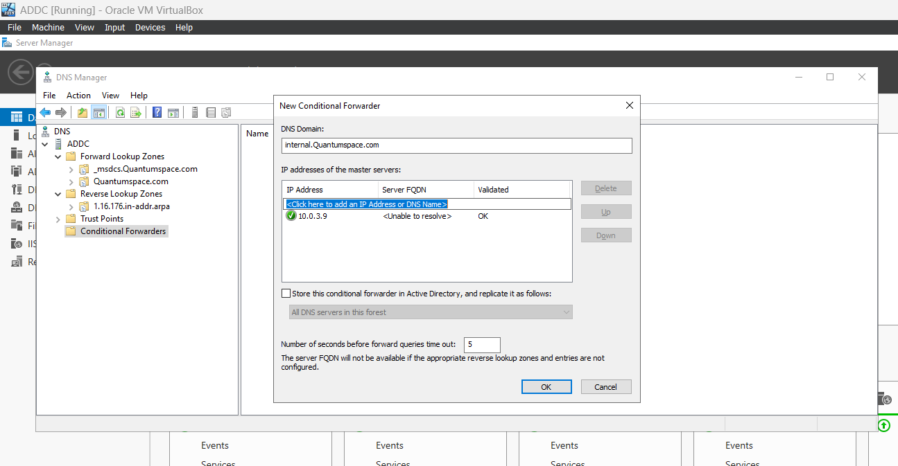

## 5. Create A record in the zone for VM in spoke1 vnet.

- Go to the private zone created> Recordset +Add

- Give the name and server private IP

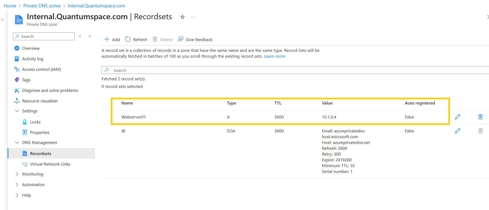

## 6. Verify Resolution Inbound & outbound DNS queries

- From an on-prem client, run: nslookup vmname.internal.Quantumspace.com

- You should get the private IP of the Azure VM

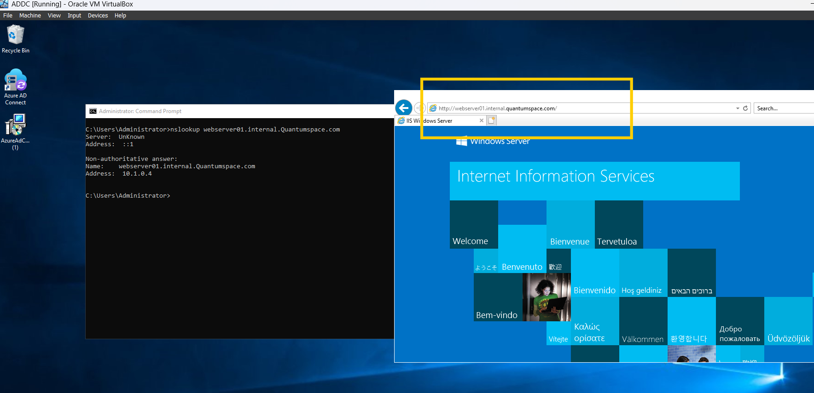

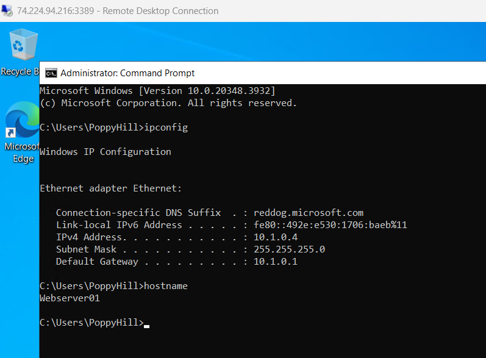

From Azure VM, run: nslookup ADDC 176.16.0.1

