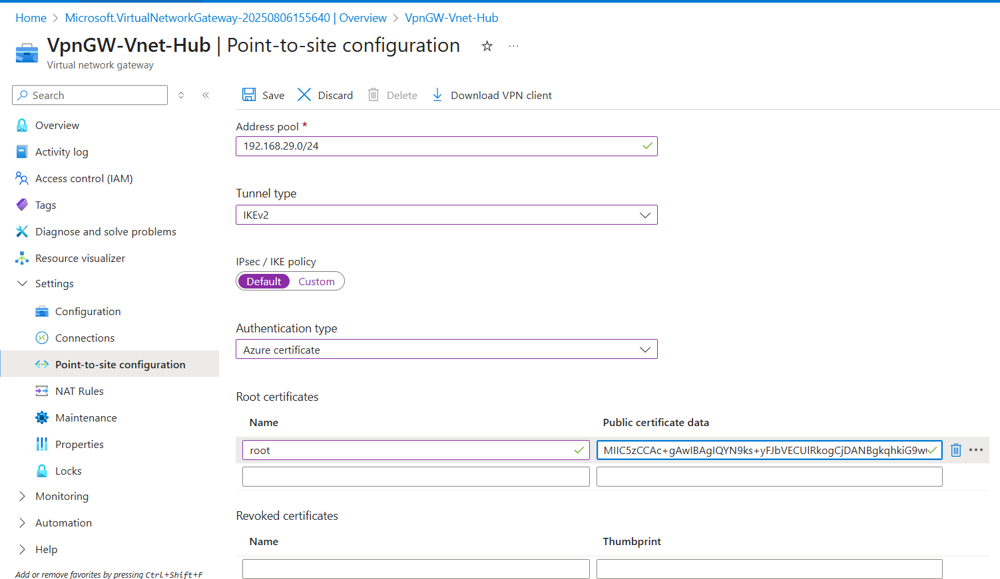

# Setup Point-to-Site Connection
------------------------------------------------------

- Generate Certificate- On your local machine (Windows), open PowerShell as admin and Run the following script to create a root certificate: 

$params = @{

    Type = 'Custom'

    Subject = 'CN=P2SRootCert'

    KeySpec = 'Signature'

    KeyExportPolicy = 'Exportable'

    KeyUsage = 'CertSign'

    KeyUsageProperty = 'Sign'

    KeyLength = 2048

    HashAlgorithm = 'sha256'

    NotAfter = (Get-Date).AddMonths(24)

    CertStoreLocation = 'Cert:\CurrentUser\My'

}

$cert = New-SelfSignedCertificate @params

This creates a root certificate named P2SRootCert valid for 24 months.

- Run the following script to create a Client certificate:

$params = @{

       Type = 'Custom'

       Subject = 'CN=P2SChildCert'

       DnsName = 'P2SChildCert'

       KeySpec = 'Signature'

       KeyExportPolicy = 'Exportable'

       KeyLength = 2048

       HashAlgorithm = 'sha256'

       NotAfter = (Get-Date).AddMonths(18)

       CertStoreLocation = 'Cert:\CurrentUser\My'

       Signer = $cert

       TextExtension = @(

        '2.5.29.37={text}1.3.6.1.5.5.7.3.2')

   }

   New-SelfSignedCertificate @params

- Export Certificates: Export Root CA in .cer format to upload in azure and client certificate in .pfx format(create password to save file) and install to the client.

- Configure Point-to-Site Settings: Go to Vpn gateway- VpnGW-Vnet-Hub → Point-to-site configuration

Add Address pool: e.g., 192.168.29.0/24 Tunnel type: IKEv2 and/or SSTP Authentication type: Certificate and Upload root certificate (.cer) and then save.

- After saving config, click Download VPN client, Extract and run the installer (choose Amd64 or x86 based on your system)

- Connect to Azure: Launch VPN client → Connect, You should now have access to Azure resources in the VNet.

