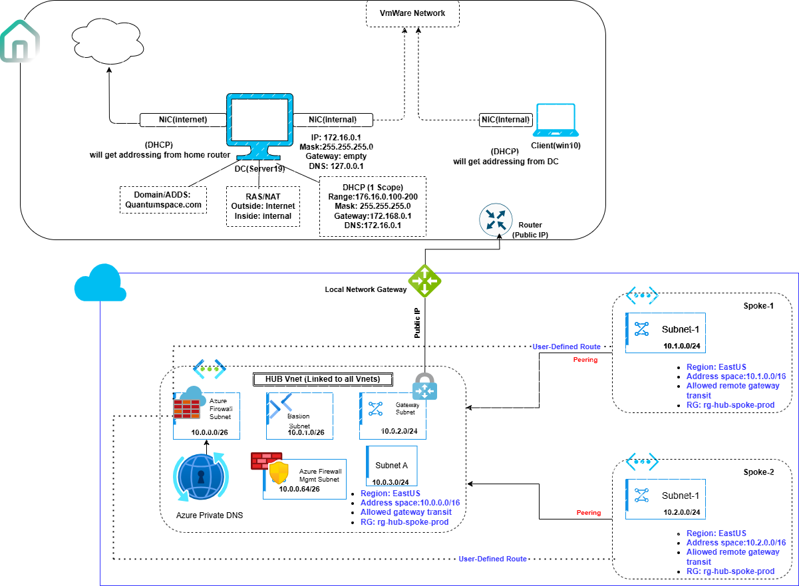

# Azure-PrivateMesh-Lab

## Objective

This project aims to design and implement a Hub-and-Spoke network architecture in Microsoft Azure, integrating it with an on-premises setup via a Site-to-Site (S2S) VPN connection. The goal is to enable secure, scalable, and efficient communication between on-prem resources and Azure workloads while enforcing centralized security policies.

## Skills Learned

**Azure Networking:** Configured Virtual Networks (VNets), subnets, and VNet peering.

**Hybrid Cloud Integration:** Established Site-to-Site VPN connectivity between Azure and an on-premises Domain Controller.

**Security & Access Control:** Implemented Azure Firewall, User-Defined Routes (UDRs), and Private DNS for enhanced security and controlled traffic flow.

**Remote Access & Management:** Configured Azure Bastion for secure remote access to VMs without exposing RDP/SSH ports.

## Architecture Overview

 

**On-Premises Setup:**

1.Domain Controller (DC)

2.Site-to-Site VPN Connection to Azure

**Azure Hub-and-Spoke Design:**

Hub Network:

1.Virtual Network Gateway (for S2S VPN)

2.Azure Firewall (for centralized security)

3.Private DNS (for internal name resolution)

Spoke Networks:

1.Peered with the Hub for connectivity

2.Subnets configured with NSGs and UDRs

**Access & Security:**

1.Azure Bastion for secure VM access

2.Traffic flow managed via Azure Firewall and UDRs

## Tools & Services Used

**Networking:** Virtual Networks, Subnets, VNet Peering

**Security:** Azure Firewall, NSGs, UDRs, Private DNS

**Hybrid Connectivity:** Site-to-Site VPN, Virtual Network Gateway

**Management & Access:** Azure Bastion, Azure Portal, PowerShell
